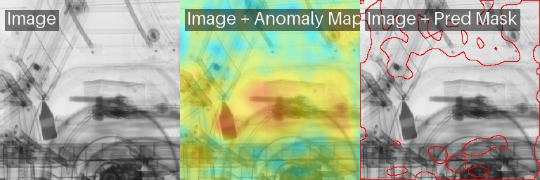

## Software AI system for anomaly detection

System AI do automatycznej identyfikacji anomalii na obrazach RTG środków transportu, wspierający funkcjonariuszy KAS w wykrywaniu ukrytych

### To install all dependencies
		sh ./install.sh

### Train a mode if needed on your custom data
		sh ./train_model.sh

### Run anomaly detector
		sh Usage: ./checkanomaly.sh <image_path> [output_dir]

